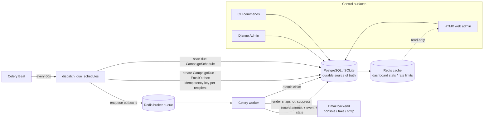

# Architecture

Process flow (one row): `schedule → CampaignRun → EmailOutbox (pending) → enqueued →
claimed → sending → sent` (or `retry_scheduled → … → dead_lettered`, or
`skipped_suppressed` / `cancelled`).

The system follows a DB-as-source-of-truth pattern.

1. Operators create templates, recipients, campaigns, and schedules through CLI, Django Admin, or web views.
2. The dispatcher scans due `CampaignSchedule` rows.
3. Each occurrence becomes a `CampaignRun`.
4. Each recipient in the campaign list gets one `EmailOutbox` row with a unique idempotency key.
5. Celery workers receive only an outbox ID.
6. A worker must atomically claim the row before rendering or sending.
7. Attempts and lifecycle events are recorded in the database.

Redis can be used as the Celery broker, Django cache backend, and throttle counter store. Redis does not own correctness.

**Throttling note:** send-rate counters live in Django cache. With the default LocMem backend each process (web, worker) maintains its own counters, so global limits are approximate until `REDIS_CACHE_URL` is configured for a shared cache across workers.

**Recovery note:** stale `enqueued` rows are re-published after `ENQUEUED_STALE_SECONDS`; stale `claimed`/`sending` rows on scheduled, active, or paused campaigns are released to `retry_scheduled` after `CLAIMED_STALE_SECONDS`.

SQLite works for local demos and tests. PostgreSQL is preferred for concurrent workers because row locks and `select_for_update` semantics are stronger.

**Shared modules:** `emailauto.core` holds cross-cutting state machines and exceptions but is intentionally **not** registered in `INSTALLED_APPS` — it is a library package imported by the Django apps. `CampaignRun` transitions are enforced in `emailauto/scheduling/run_transitions.py` and the dispatcher. Scheduled campaigns are auto-promoted to `active` when dispatch begins.

**Operator audit:** dashboard/CLI mutations record durable `operator_action` events (username, action, metadata) via `emailauto.observability.audit`.

**Out of scope:** inbound bounce/webhook processing and automatic list hygiene — suppressions are operator/import driven. See [docs/out_of_scope.md](out_of_scope.md).

The concurrency model — atomic single-statement claims, `SELECT … FOR UPDATE SKIP LOCKED`
dispatch, and the unique constraints that are the real duplicate-guard — and its
deadlock/starvation posture are documented in
[docs/adr/0001-concurrency-and-locking.md](adr/0001-concurrency-and-locking.md).

